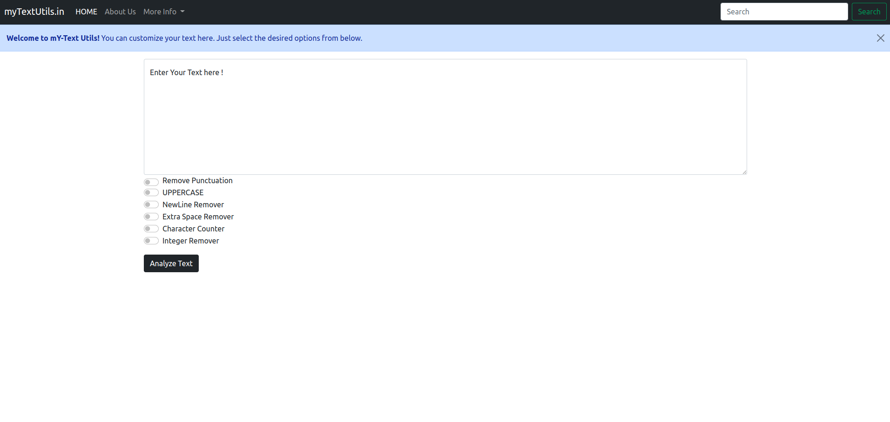

# textutils
This project was created using the Python framework Django. We attempted to build a website with a structure that allows users to enter any text and analyse it by deleting any punctuation or unnecessary letters.

Dependencies - Libraries & Frameworks: 
    <li>Django - Framework</li>
    <li>bootstrap</li>
    <li>html & css</li>
    <li>python</li>
    
# Steps to run this project
<ol type = 1> 
    <li> After installing all the dependencis and make and copy and extract the project </li>
    <li>Open terminal and change directory to textutils</li>
    <li>Change directory in which manage.py file is present</li>
    <li>In terminal type -> python manage.py runserver(for windows user)</li>
    <li>Finally Visit the url in browser. The server runs on the default port 8000</li>
</ol>

# Home Page Screen Shot 

